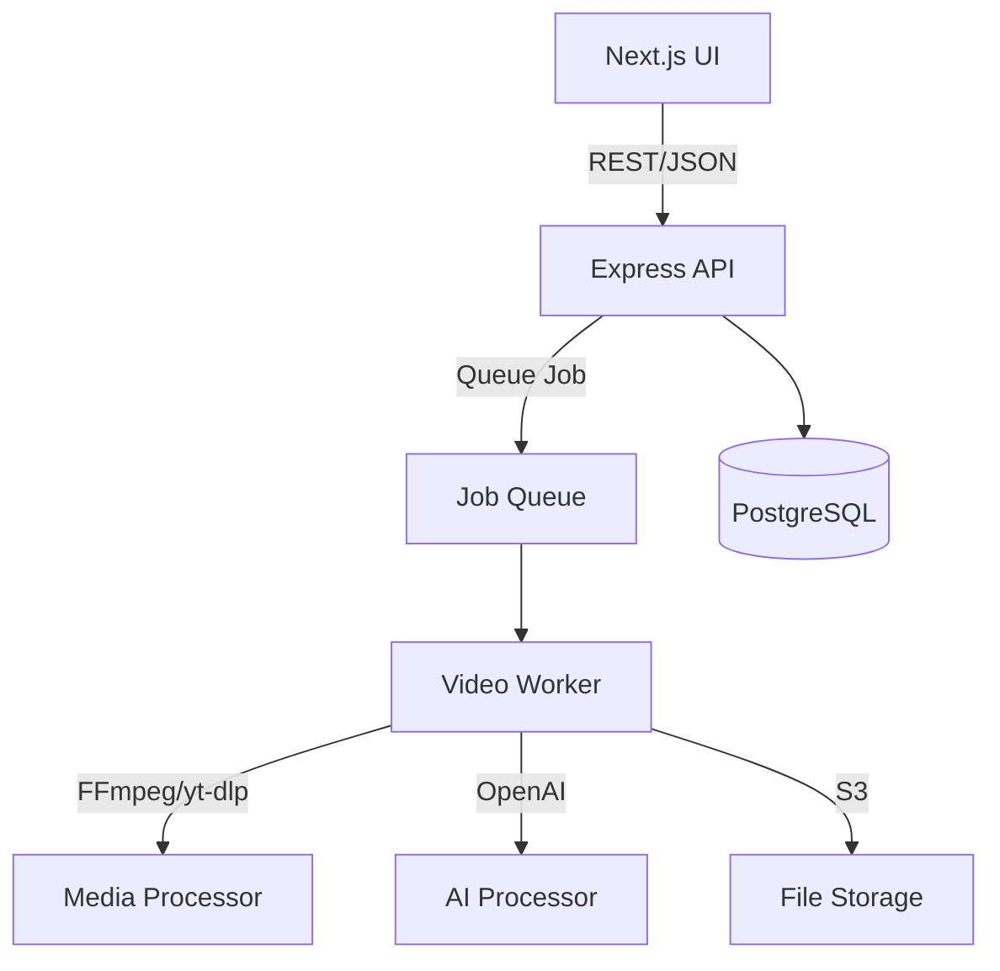

# Video-to-SOP Converter – Product Requirements Document (General Purpose)

## Table of Contents
1. Project Overview
2. Technical Architecture
3. Project Structure
4. Feature Phases
5. Testing & Deployment
6. Error Handling & Security
7. Performance & Scalability
8. Accessibility & UX Quality
9. Compliance & Privacy
10. Monitoring & Analytics
11. Implementation Checklist

---

## 1. Project Overview

**Goal:**  
Build a world-class web application that converts any YouTube video (or uploaded video file) into a professional, detailed Standard Operating Procedure (SOP) using AI.

**Core Features:**  
1. Video upload (local files + YouTube URLs)
2. Accurate audio extraction & AI transcription (OpenAI Whisper or local)
3. Structured SOP generation (GPT-4+)
4. Automatic screenshot extraction
5. Export to PDF/Markdown (with embedded screenshots)
6. Webhook & API endpoints for n8n/Make.com
7. Job history & management dashboard
8. Status notifications and progress tracking

**Tech Stack:**  
- **Frontend:** Next.js 14 (App Router), Tailwind CSS, React, TypeScript  
- **Backend:** Node.js (Express), TypeScript  
- **AI:** OpenAI Whisper & GPT-4 APIs (configurable by .env)  
- **Video:** FFmpeg, yt-dlp  
- **Database:** PostgreSQL  
- **Queue:** BullMQ (Redis-backed)  
- **Storage:** Local & S3 (prod)  
- **Deployment:** Vercel (frontend), Railway/Render (backend), Docker for CI/CD  
- **Testing:** Jest, React Testing Library, Cypress (e2e)

---

## 2. Technical Architecture



---

## 3. Project Structure

```
video-to-sop/
├── frontend/
│   ├── app/
│   ├── components/
│   ├── lib/
│   └── public/
├── backend/
│   ├── src/
│   │   ├── routes/
│   │   ├── services/
│   │   ├── utils/
│   │   ├── workers/
│   │   └── __tests__/
│   ├── prisma/
│   └── uploads/
├── docker-compose.yml
├── .env.example / .env.local
└── README.md
```

---

## 4. Feature Phases

### **Phase 1: Core Infrastructure**
- Next.js frontend + Express backend, TypeScript
- Local/dev Docker Compose setup for Postgres, Redis, backend, frontend

### **Phase 2: File & YouTube Upload**
- Drag & drop/upload for video files (.mp4, .mov, .avi, .mkv, 100MB limit)
- YouTube URL ingestion (yt-dlp)
- Progress indicators and error states

### **Phase 3: Video Processing & Transcription**
- Extract audio (FFmpeg)
- Whisper transcription (fallback to local/OSS model if OpenAI key not set)
- Store job status & results in Postgres

### **Phase 4: Screenshot Extraction**
- Extract 5-10 evenly distributed screenshots via FFmpeg
- Thumbnails for SOP visualization

### **Phase 5: SOP Generation & Enhancement**
- Structure SOP via GPT-4, with these sections:
    1. Title
    2. Purpose
    3. Scope
    4. Safety Requirements (if applicable)
    5. Required Equipment/Tools (if applicable)
    6. Step-by-step Procedure (numbered, screenshot references)
    7. Quality Checks (if applicable)
    8. Documentation Requirements (if applicable)
    9. Revision History
- References to screenshots at relevant steps ("[See Screenshot 2]")
- (Optional, stretch) Analyze screenshots via GPT-4 Vision, add contextual notes

### **Phase 6: Export, Webhooks & API**
- Export completed SOPs as PDF (with embedded images) and Markdown
- Download directly from UI; shareable links with expiring signed URLs
- Webhook/API endpoints for n8n/Make.com for automated workflows

### **Phase 7: Job History & Dashboard**
- List of processed jobs (videos, status, timestamp, download links)
- Admin UI for job review, reprocessing, and error logs

---

## 5. Testing & Deployment

- Jest + React Testing Library: 80%+ code coverage on core business logic and UI
- Cypress: End-to-end flows for upload → SOP → export
- All critical paths (upload, process, export, webhook) have automated tests
- Linting (ESLint + Prettier) enforced via CI pipeline
- Docker Compose for local dev; Dockerfile for prod backend
- Vercel (frontend) & Railway/Render (backend) deploy scripts in README

---

## 6. Error Handling & Security

- Max upload size (100MB default; configurable)
- Supported file formats only, server-side validation
- XSS, CSRF, and SSRF protections
- Sanitized file uploads, stored outside webroot
- OpenAI API key secured server-side (.env only), never in frontend
- Rate limiting for all API endpoints (configurable in .env)
- Signed URLs for download links; files expire after N days (configurable)
- Clear, user-friendly error messages for all failure modes

---

## 7. Performance & Scalability

- Video/audio streaming instead of loading whole file in memory
- Parallelized screenshot extraction and AI calls when possible
- Queue-based processing (BullMQ, Redis)
- S3 offloads for production storage, with background cleanup of expired jobs
- CDN caching of static assets, pre-optimized images
- Target: sub-3s cold start, 95th percentile job turnaround < 2min for 10-min videos

---

## 8. Accessibility & UX Quality

- Fully keyboard-navigable UI, including upload & download flows
- WCAG 2.1 AA contrast for all text and buttons
- `aria-*` attributes and semantic HTML for screenreader compatibility
- All icons, progress bars, and status indicators have text equivalents
- Responsive mobile UI; tested at breakpoints (375px, 768px, 1024px+)
- Accessible color palette (use [Accessible Palette](https://accessiblepalette.com) or similar tool)
- Loading, empty, and error states for every view

---

## 9. Compliance & Privacy

- GDPR-compliant data handling (easy account/data deletion, no long-term logs)
- Cookie policy & consent banner for analytics if needed
- No PII stored without explicit consent
- Users can download/export/delete their own data at any time
- All logs redact sensitive info (API keys, file names, etc.)

---

## 10. Monitoring & Analytics

- Metrics:
    - Processing time per video
    - Success/failure/error rates
    - Peak job queue depth
    - API usage/costs
    - User engagement (dashboard view, download count)
- Logging:
    - Winston for structured logs
    - Sentry for error tracking
    - Datadog or LogRocket for user-level monitoring (optional)
- Alerts:
    - Slack/email/webhook for high error rates, system failures, or AI cost overruns

---

## 11. Implementation Checklist

- [ ] Initialize Next.js frontend
- [ ] Initialize Express backend
- [ ] Configure TypeScript and ESLint
- [ ] Set up environment variables
- [ ] Build video upload & YouTube ingestion
- [ ] Implement video/audio processing
- [ ] Integrate Whisper transcription
- [ ] Integrate GPT-4 SOP generation
- [ ] Implement screenshot extraction
- [ ] Export to PDF/Markdown
- [ ] Add webhooks/API for automation
- [ ] Build job history/dashboard
- [ ] Write tests and CI/CD
- [ ] Deploy to Vercel/Railway/Render

---

**Note:**  
This PRD is for a general-purpose Video-to-SOP Converter. The app is designed to generate detailed, professional SOPs for any type of YouTube video or uploaded video file, not just facility walkthroughs.

---

**I will always refer to this PRD to keep the project on track.** 